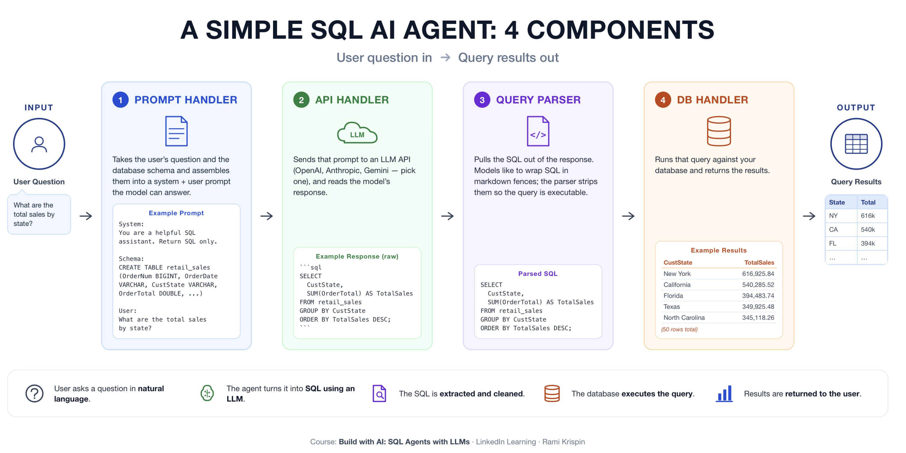

# SQL AI Agent Series for AI Developers

This is the supporting repository for the SQL AI Agent series for AI
developers in [Rami Krispin's newsletter](https://ramikrispin.substack.com/).

This series is based on my LinkedIn Learning course, [*Build with AI: SQL
Agents with Large Language
Models*](https://www.linkedin.com/learning/build-with-ai-sql-agents-with-large-language-models).

## Tutorials

| Tutorial | Article | Code |
| --- | --- | --- |
| **Introduction to SQL AI Agents: The Four Components Behind Natural Language SQL** | [Read the tutorial](https://ramikrispin.substack.com/p/introduction-to-sql-ai-agents-the) | — |
| **Context in SQL AI Agents: The Three Layers Behind Reliable Answers** | [Read the tutorial](https://ramikrispin.substack.com/p/context-in-sql-ai-agents-the-three) | — |
| **📌 Part I: Set up a Python environment for SQL AI agents** | TBD | [Setup guide](tutorials/README.md) |
| **⏭️ Part II: Prepare data for a SQL AI agent with DuckDB and Ibis** | TBD | [Notebook](tutorials/03a_duckdb_settings.ipynb) |

## License

This template is licensed under a [Creative Commons
Attribution-NonCommercial-ShareAlike 4.0
International](https://creativecommons.org/licenses/by-nc-sa/4.0/) License.
